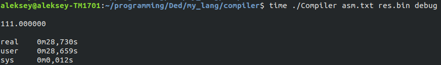
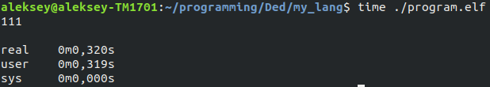

# Esoteric programming language 
This is simple esoteric language, something between python and c++.

## How it work?

### There are three parts of program.

First parts is a translator from my language to my assembler.

Second part is a compile from my assembly language to my binary code. Then you can run this binary code on a simple stack processor. Stack processor is working on a C language. It's model of real cpu.

After it you can convert my binary code to x86-64 binary elf file and run it on real cpu.

## How to use it? 

To compile code:

```make INPUT=your_file ELF_FILE=result.elf```

If you want compile some code on assembler, then run 

```make asm INPUT=asm_file```

CPU time on a stack processor 



CPU time on a real assembly



Ratio: 96/1
